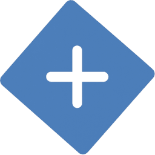
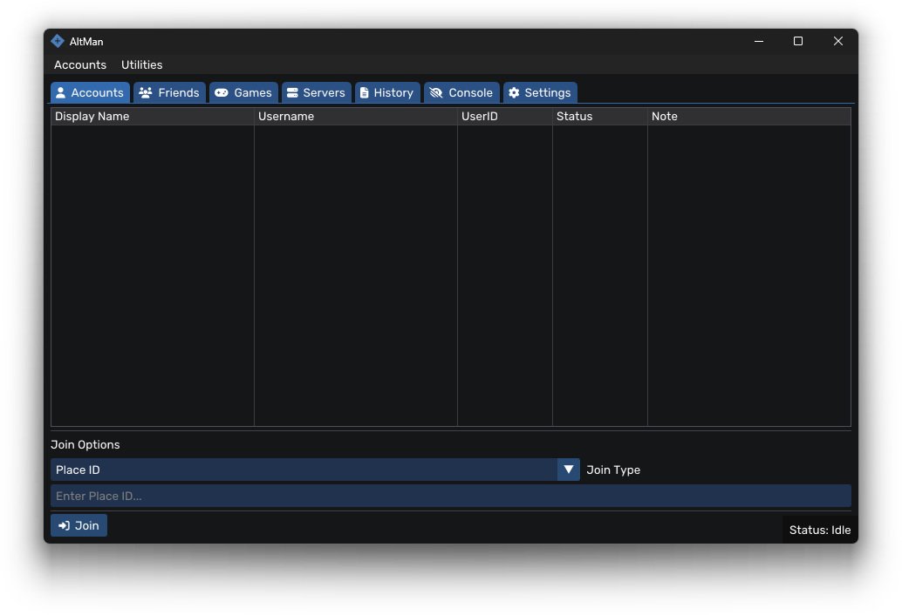

    

<h1>AltMan</h1>

AltMan is a robust and intuitive tool designed to help you manage multiple Roblox accounts effortlessly.

---

## Features

* **Multi-Account Management** – Add, organize, and securely store cookies for multiple Roblox accounts.
* **Quick Join** – Instantly join games via **JobID** or **PlaceID**.
* **Friends Integration** – View and manage friends per account.
* **Friend Requests** – Send friend requests directly from the interface.
* **Server Browser** – Explore active Roblox game servers.
* **Advanced Filtering** – Sort servers by ping or player count.
* **Game Discovery** – Search Roblox games by title or keyword.
* **Log Parser** – Convert Roblox logs into a human-readable format.

---

## Preview

---

## Usage Guide

### Adding Accounts

1. Launch **AltMan**.
2. Navigate to `Accounts` on the menu bar.
3. Click `Add Account` > `Add Via Cookie`.
4. Paste your cookie and click **Add Cookie**.

### Joining Games

* **By JobID**: Enter the JobID in the Quick Join field.
* **By PlaceID**: Use a valid PlaceID to connect to a server.
* **By Username**: Connect directly to a user’s session (if joins are enabled).

> 💡 **Tip**: You can also join games through the **Servers** or **Games** tabs.

### Managing Friends

1. Select an account from the list.
2. Go to the **Friends** tab to see the current friend list.
3. Use the **Add Friend** button to send requests via username or UserID.

---

## Requirements

* Windows 10 or 11 (Tested for Windows 11 24H2)
* Active internet connection

---

## Security

* Your account cookies are **stored locally and encrypted**.
* All save files are kept inside a **storage** folder in the application's directory.
* **Never** share your cookies with anyone.
* Use the tool at your own risk.

---

## License

This project is licensed under the **MIT License**. See the `LICENSE` file for full details.

---

## Contributing

Pull requests are welcome! For substantial changes, please open an issue to discuss the proposed improvements
beforehand.

---

## ⚠️ Disclaimer

This tool is **not affiliated with Roblox Corporation**. Use responsibly and in compliance
with [Roblox’s Terms of Service](https://en.help.roblox.com/hc/en-us/articles/203313410-Roblox-Terms-of-Use).